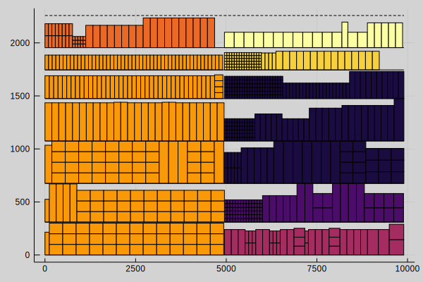

# Shelf Space Allocation

This package contains an optimization model, written as *mixed-integer linear program (MILP)*, for solving the *Shelf Space Allocation Problem (SSAP)* in the context of retail stores and utilities for loading input parameters from files, saving results into files and for visualizing results. The documentation covers the formulation of the optimization model in detail and how to interpret the results from the optimization. In the code, the optimization model is implemented using `JuMP.jl`.

This package is a part of a research project at the Systems Analysis Laboratory at Aalto University, authored by *Fabricio Oliveira* and *Jaan Tollander de Balsch*.
