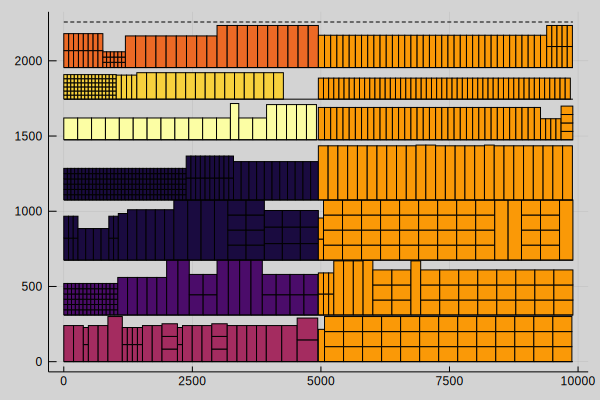

# ShelfSpaceAllocation

This package contains an optimization model for solving the *shelf space allocation problem (SSAP)* in the context of retail stores, formulated as *mixed-integer linear program (MILP)*. We intended the package for both developing and running the model. It includes the model, visualization capabilities, input/output related functions, and example instances. The [documentation](http://jaantollander.com/ShelfSpaceAllocation.jl/) covers how to use the package, its functionalities, and the model in detail. Inside the `examples` directory, there are two notebooks, [example.ipynb](./examples/example.ipynb) and [heuristics.ipynb](./examples/heuristics.ipynb), which demonstrate how to use this package.

This package is a part of a research project at the Systems Analysis Laboratory at Aalto University, authored by *Fabricio Oliveira* and *Jaan Tollander de Balsch*.
