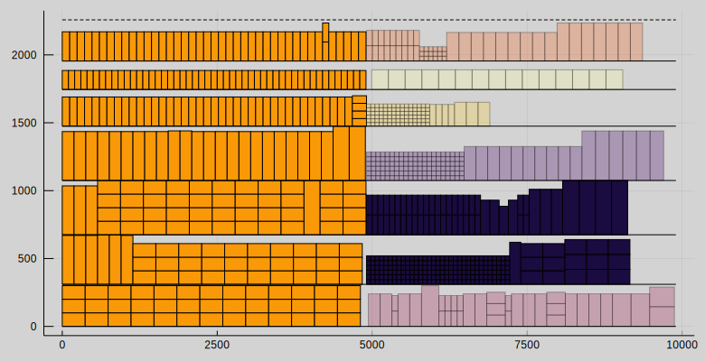
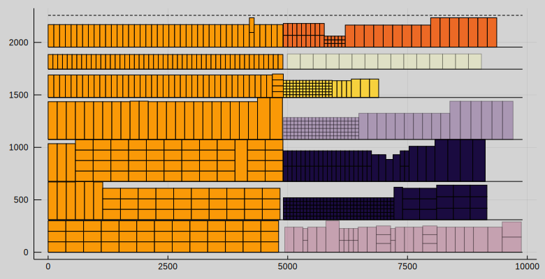
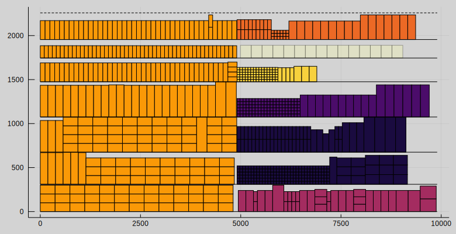
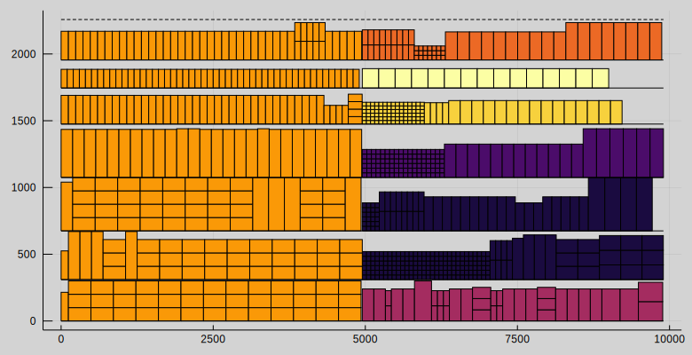

# Heuristics
!!! warning
    Currently, heuristics are in an experimental state. Heuristics are tested only on a single instance. Therefore it cannot be guaranteed that they will obtain good results in all instances. Heuristics can be found at: `examples/heuristics.jl`

Solving a mixed-integer linear program can be computationally difficult and integer programming is indeed NP-complete problem. Heuristics can be used to obtain feasible solutions and improving them faster than using deterministic algorithms by trading off some accuracy. Also, heuristics are not guaranteed to obtain good solutions. Two heuristics, *relax-and-fix* and *fix-and-optimize*, are covered here. In the literature, they are referred to as *MIP-based heuristics*, a type of metaheuristics. [^Wolsey1998]

## Definitions
Definitions in the context of linear programming heuristics.

- *Relaxation* means removing integrality constraint from a variable.

- *Fixing* variable means setting a fixed value for a variable.

## Relax-and-Fix
The goal of relax-and-fix heuristic is to find reasonably good feasible solutions fast. These solutions can be later improved with the fix-and-optimize heuristic.

The main design decision for relax-and-fix heuristic is choosing which variables will be relaxed. For shelf space allocation model the main options are the integer variables for number of facings $n_{p,s}$ and binary variables for block-shelf allocation $z_{b,s}$, $z_{b,s}^f$ and $z_{b,s}^l$. Testing indicated that relaxation of block-shelf allocation variables is a much better choice because the reduction to the computational time was much larger compared when using variables for number of facings.

Block-shelf allocation variables have two indices, blocks $b$ and shelves $s$. The most logical choice is to partition the variables by the blocks. This is done by partitioning the set of blocks $B$ into $n$ disjoint subsets $B_1, B_2, ..., B_n$. This also determines the order in which the variables are relaxed. Partitioning affects the runtime and goodness of the heuristic solution. The optimal way to partition is still unknown to us and partitioning policy is a user decision.

!!! example
    For example, $B_1$ could be partition to contain two blocks that are predicted to have most items allocated to the shelves, then partition $B_2$ to contain two blocks that are predicted to have second-most items allocated to the shelves and so forth.

Relax-and-fix heuristic. Start the iteration counter from $i=1$.

1) *Relax*. Solve the relaxed shelf space allocation model where

$$\begin{aligned}
& z_{b,s}, z_{b,s}^f, z_{b,s}^l∈\{0,1\}, & b∈B_i, ∀s \\
& z_{b,s}, z_{b,s}^f, z_{b,s}^l∈[0,1], & b∈B_{i+1}∪B_{i+2}∪...∪B_n, ∀s.
\end{aligned}$$

2) *Fix*. Fix the variables $z_{b,s}, z_{b,s}^f, z_{b,s}^l$ for blocks $b∈B_i$ and forall shelves $s$ at their values.

3) If iteration counter is $i=n$ return the solution. Otherwise, increment the iteration counter $i$ by one and repeat from step 1.

The block-shelf variables will be relaxed by a subset of blocks at a time. This transforms the original problem into one where all the blocks are not being allocated at the same time but one subset of blocks at a time.

## Fix-and-Optimize
The goal of fix-and-optimize heuristic is to improve the existing feasible solution, for example, one obtained from relax-and-fix heuristic. Fix-and-optimize heuristic operates by fixing a part of the variables to the values in the existing solution and making the other variables unfixed and then performing the optimization.

For the shelf space allocation model, the block-shelf allocation variables were chosen as the target variables because they have the largest impact on the computational time. The simplest form of fix-and-optimize is to fix all of the target variables, which was used here. More intelligent strategies where only a part of the target variables are fixed could be beneficial for large instances, but this remains as a research question.

## Example

Relax-and-fix iteration 1: Blocks $B_1=\{7, 1\}$

Relax-and-fix iteration 2: Blocks $B_2=\{6, 8\}$

Relax-and-fix iteration 3: Blocks $B_3=\{2, 4\}$

Relax-and-fix iteration 4: Blocks $B_4=\{9, 3, 5\}$

Fix-and-optimize

## References
[^Wolsey1998]: Wolsey, L. A. (1998). Integer programming. Wiley.
