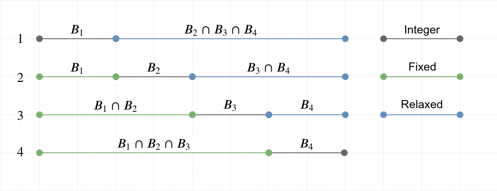

# Heuristics
Solving a mixed-integer linear program can be computationally difficult and integer programming is indeed NP-complete problem. Heuristics can be used to obtain feasible solutions and improving them faster than using deterministic algorithms by trading off some accuracy. Also, heuristics are not quaranteed to obtain good solutions. Two heuristics, *relax-and-fix* and *fix-and-optimize*, are covered here. In the literature, they are referred as *MIP-based heuristics*, a type of metaheuristics. [^Wolsey1998]

## Relax-and-Fix

Partition the set of blocks $B$ into $n$ disjoint subsets $B_1, B_2, ..., B_n$. Partitioning affects the runtime and goodness of the heuristic solution. The optimal way to partition is still unknown to us.

!!! example
    For example, $B_1$ could be partition to contain two blocks that are predicted to have most items allocated to the shelfs, then partition $B_2$ to contain two blocks that are predicted to have second most items allocated to the shelfs and so forth.

Each iteration, the *relax-and-fix* heuristic solves the original optimization problem such that the block constraints $z_{b,s}, z_{b,s}^f, z_{b,s}^l$ are either fixed, relaxed or binary constrained for a particular block $b$.

* **Fix**: Fix the block constraint for the blocks that were fixed or integer constrained in the previous iteration.
* **Binary**: Binary constraint for the next block from the previous iteration
* **Relax**: Relax the binary constraints for rest of the blocks.

The algorithm runs for $n$ iterations and returns a feasible solution. If the model is infeasible at any iteration, it returns infeasible.

## Fix-and-Optimize
!!! note
    Not yet implemented.

## References
[^Wolsey1998]: Wolsey, L. A. (1998). Integer programming. Wiley.
