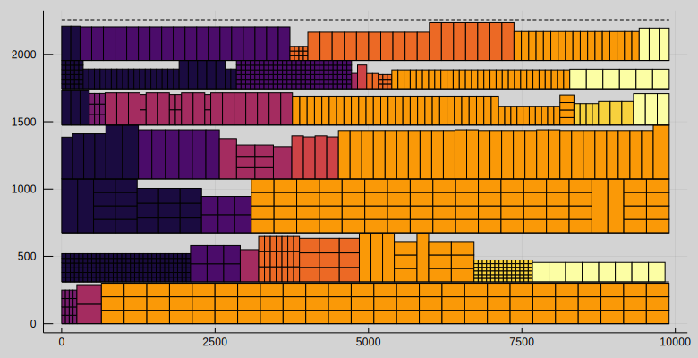

# ShelfSpaceAllocation.jl

This section explains the mathematical formulation of the *mixed integer linear program* for solving the *shelf space allocation problem*. Ph.D. thesis by [^Teresa2015] contains a good introduction to the shelf space allocation problem. We recommend to read the chapters 1.3 and 3 as they relate to the model we present here. Book by [^Williams2013] covers how to model problems using mathematical programming including linear and integer programming.

The objective of [`ShelfSpaceAllocationModel`](@ref) is produce an allocation for product to the shelves such that it minimizes losses while taking into account consumer demand for products, minimize empty space on shelves and place products at preferred heights. The model is tailored towards smaller retail stores for which the shelf space accounts for a large portion of the total inventory space. The resulting allocation can be used to product a [Planogram](@ref) for the retailers.

> *A planogram is a diagram that shows how and where specific retail products should be placed on retail shelves or displays in order to increase customer purchases.* [^Rouse2010]

The model contains following constraints.

* *Integrality constraints* -- The number of products allocated to each shelf must be integral.
* *Physical constraints* -- Constraints limiting the physical dimensions, e.g. width, height, and weight, of the products on the shelves.
* *Control constraints* -- Constraints which can be controlled by changing parameters values, such as the minimum number of product facings for a particular product or the preferred height placement for a product.
* *Block constraints* -- Constraints products which belong to the same category to be placed together in rectangular shapes.

We can create an instance of the model using [`ShelfSpaceAllocationModel(::Params, ::Specs)`](@ref). We use the [`Specs`](@ref) struct to control whether we include block constraints into the model.

## Sets and Subsets
Shelf space allocation problem consists of following *sets and subsets*:

-  $p∈P$ -- A set of **products**.
-  $s∈S$ -- A set of **shelves**.
-  $b∈B$ -- A set of **blocks**. Blocks are an index of mutually exclusive subsets of products.
-  $m∈M$ -- A set of **modules**. Modules are an index of a mutually exclusive subset of shelves.
-  $P_b⊆P$ -- A **block** is a subset of products.
-  $S_m⊆S$ -- A **module** is a subset of shelves.

## Parameters
Both products and shelves have several attributes associated with them. These attributes are also referred to as parameters since their values are given by the user. They are denoted using capital letters.

*Product* parameters:

-  $N_p^{min}$, $N_p^{max}$ -- The minimum and maximum number of facings for product $p$
-  $G_p$ -- Unit profit of product $p$; used as shortage penalty (treated to be $\max\{0, G_p\}$
-  $R_p$ -- Replenishment period of product $p$
-  $D_p$ -- Demand forecast of product $p$
-  $L_p$ -- Priority weight for height placement of product $p$
-  $W_p$ -- Facing width of product $p$
-  $H_p$ -- Height of product $p$
-  $M_p$ -- Unit weight of product $p$
-  $SK_p$ -- Max stack per product $p$

*Shelf* parameters:

-  $M_s^{min}$, $M_s^{max}$ -- The minimum and maximum unit weight on shelf $s$
-  $W_s$ -- Width of shelf $s$
-  $H_s$ -- Height of shelf $s$
-  $L_s$ -- Shelf level, counted from bottom to top

*Product-shelf* parameters:

-  $P_{p,s}$ -- Number units per facing of product $p$ on shelf $s$

*Constant* parameters:

-  $SL$ -- Slack, maximum difference in block starting points and between block max and min width, default $0.0$
-  $w_1$ -- Objective weight for `empty_space_penalty`, default $0.5$
-  $w_2$ -- Objective weight for `shortage_penalty`, default $10.0$
-  $w_3$ -- Objective weight for `shelf_up_down_penalty`, default $0.1$

Currently, the objective weights are set to empirically tested values.

To pass parameters as arguments we use the [`Params`](@ref) struct. We can load parameters from CSV files using [`Params(::AbstractString, ::AbstractString)`](@ref).

## Objective
!!! note
    Currently, JuMP doesn't support multi-objective optimization, and thus the weights are manually tuned such that the algorithm obtains satisfying solutions. However, solvers such as Gurobi have capabilities for multi-objective optimization and using them should be considered in the future.

The shelf space allocation model contains multiple objectives. The multi-objective formulation is reduced into single objective using linear scalarization, i.e. weighted sum

$$\min ∑_{i=1}^n w_i f_i$$

where $f_i$ are the objectives and $w_i>0$ are the weight parameters. We have $n=3$ different individual objectives as follows.

The total empty shelf space.

$$f_1=∑_s o_s$$

Total profit loss from product shortage.

$$f_2=∑_p G_p e_p$$

Product shelf height placement penalty. Preferres the placement of products with higher weight $L_p$ to lower shelves.

$$f_3=∑_{p,s} L_p L_s n_{p,s}$$

We use [`Objectives`](@ref) struct to store the objetive values after optimization. We can query the values from the model using [`Objectives(::ShelfSpaceAllocationModel)`](@ref) method.

## Basic Variables and Constraints

Number of facings of product $p$ on shelf $s$

$$n_{p,s} ∈ ℤ_{≥0},\quad ∀p,s$$

The height of product $p$ allocated on shelf $s$ must be less or equal to the shelf height

$$n_{p,s}=0,\quad ∀p,s∣H_p > H_s$$

The unit weight of product $p$ allocated on shelf $s$ must be less or equal to the maximum unit weight allowed on the shelf

$$n_{p,s}=0,\quad ∀p,s∣M_p > M_s^{max}$$

A decision variable which takes value $1$, if a product is allocated to a shelf, $0$ otherwise

$$y_p ∈ \{0,1\},\quad ∀p$$

$$∑_p n_{p,s} ≥ y_{p},\quad ∀p$$

The total number of facings of product $p$ must be within the given minimum and maximum

$$N_p^{min} y_p ≤ ∑_s n_{p,s} ≤ N_p^{max} y_p,\quad ∀p$$

The amount of product $p$ sold must be less or equal to the minimum of the expected sales and demand

$$s_p ≥ 0,\quad ∀p$$

$$s_p ≤ \min\left(∑_s \frac{30}{R_p} P_{p,s} n_{p,s}, D_p\right),\quad ∀p$$

!!! note
    The constraint of the form $z≤\min(x,y)$ can be linearized by replacing it with two constraints $z≤x$ and $z≤y$.

The shortage of product $p$ is the mismatch between demand and on-shelf inventory

$$e_p ≥ 0,\quad ∀p$$

$$s_p + e_p = D_p,\quad ∀p$$

Total empty space on shelf $s$ is the difference between the width of the shelf $s$ and the total width of the products on shelf $s$

$$o_s ≥ 0,\quad ∀s$$

$$∑_p W_p n_{p,s} + o_s = W_s,\quad ∀s$$

We use [`Variables`](@ref) struct to store the variable values after optimization. We can query the values from the model using [`Variables(::ShelfSpaceAllocationModel)`](@ref) method.

## Block Variables and Constraints

The width of block $b$ on shelf $s$ must be larger or equal to the sum of the widths of products $P_b$ on the shelf $s$

$$b_{b,s}≥0,\quad ∀b,s$$

$$∑_{p∈P_b} W_p n_{p,s} ≤ b_{b,s},\quad ∀b,s$$

The sum of the block widths on each shelf $s$ must be less or equal to the width of the shelf $s$

$$∑_b b_{b,s} ≤ W_s,\quad ∀s$$

An indicator variable which takes value $1$ if block is assigned on a shelf $s$, $0$ otherwise

$$z_{b,s}∈\{0,1\},\quad ∀b,s$$

$$b_{b,s} ≤ W_s z_{b,s},\quad ∀b,s$$

!!! note
    Indicator variable $σ$ is a binary variable which is forced to take value $1$ when $x>0$, otherwise $0$, by the constraint $x≤Mσ$ where $M$ is a constant coefficient representing a known upper bound for $x$.

Block width on module $m$

$$m_{b,m}≥0,\quad ∀b,m$$

$$b_{b,s} ≥ m_{b,m} - W_s (1 - z_{b,s}) - SL,\quad ∀b,m,s∣s∈S_m$$

$$b_{b,s} ≤ m_{b,m} + W_s (1 - z_{b,s}) + SL,\quad ∀b,m,s∣s∈S_m$$

---

A decision variable which takes value $1$ if shelf $s$ is the first shelf of a block $b$, $0$ otherwise

$$z_{b,s}^f∈\{0,1\},\quad ∀b,s$$

A decision variable which takes value $1$ if shelf $s$ is the last shelf of a block $b$, $0$ otherwise

$$z_{b,s}^l∈\{0,1\},\quad ∀b,s$$

Each block $b$ has only one first shelf

$$∑_s z_{b,s}^f ≤ 1,\quad ∀b$$

Each block $b$ has only one last shelf

$$∑_s z_{b,s}^l ≤ 1,\quad ∀b$$

Block assignment $z_{b,s}$ of block $b$ is continuous from the first shelf to the last shelf of the block

$$z_{b,s}^f = z_{b,s},\quad ∀b,s=1$$

$$z_{b,s}^l = z_{b,s},\quad ∀b,s=|S|$$

$$z_{b,s+1}^f + z_{b,s} = z_{b,s+1} + z_{b,s}^l,\quad ∀b,s∣s≤|S|-1$$

---

If block $b$ is assigned on shelf $s$ then the total number of facings assigned to shelf $s$ must be at least one

$$∑_{p∈P_b} n_{p,s} ≥ z_{b,s},\quad ∀b,s$$

If block $b$ is not assignment on shelf $s$ then the number of facings of products in $P_b$ on shelf $s$ must be zero.

$$n_{p,s} ≤ N_p^{max} z_{b,s},\quad ∀b,p,s∣p∈P_b$$

---

Block starting location (in mm) on shelf $s$

$$x_{b,s}≥0,\quad ∀b,s$$

Block starting location is zero if block $b$ is not assigned on shelf $s$

$$x_{b,s} ≤ W_s z_{b,s},\quad ∀b,s$$

Block ending location must not exceed the shelf width

$$x_{b,s} + b_{b,s} ≤ W_s,\quad ∀b,s$$

A decision variable which takes value $1$ if block $b$ precedes block $b'$, $0$ otherwise. Notice that $b$ and $b'$ are mutually exclusive, i.e. $b≠b'$

$$w_{b,b'}∈\{0,1\},\quad ∀b,b'$$

$$x_{b,s} + W_s (1 - z_{b,s}) ≥ x_{b',s} + b_{b,s} - W_s (1 - w_{b,b'}),\quad ∀b,b',m∣b≠b'$$

$$x_{b',s} + W_s (1 - z_{b', s}) ≥ x_{b,s} + b_{b,s} - W_s w_{b,b'},\quad ∀b,b',m∣b≠b'$$

Block starting location on module $m$

$$x_{b,m}≥0,\quad ∀b,m$$

$$x_{b,m} ≥ x_{b,s} - W_s (1 - z_{b,s}) - SL,\quad ∀b,m,s∣s∈S_m$$

$$x_{b,m} ≤ x_{b,s} + W_s (1 - z_{b,s}) + SL,\quad ∀b,m,s∣s∈S_m$$

---

An indicator variable which takes value $1$ if a block is assigned on a module, $0$ otherwise

$$v_{b,m}∈\{0,1\},\quad ∀b,m$$

If a block is not assigned module there must be zero facings of the product belonging to the block on the shelves belonging to the module

$$n_{p,s} ≤ N_p^{max} v_{b,m},\quad ∀p,b,m,s∣s∈S_m,p∈P_b$$

Block $b$ is assigned to only one module $m$

$$∑_m v_{b,m} ≤ 1,\quad ∀b$$

## References
[^Teresa2015]: Teresa, M. (2015). The Retail Shelf Space Allocation Problem: New Optimization Methods Applied to a Supermarket Chain.

[^Williams2013]: Williams, H. P. (2013). Model building in mathematical programming. John Wiley & Sons.

[^Rouse2010]: Rouse, M. (2010). What is planogram? Retrieved from [https://whatis.techtarget.com/definition/planogram](https://whatis.techtarget.com/definition/planogram)
