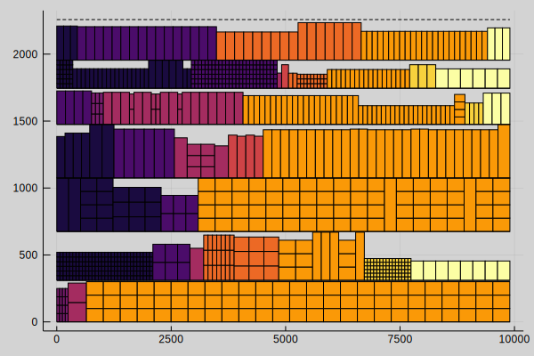

# Model
This section explains the mathematical formulation of the Mixed Integer Linear Program (MILP) for solving the Shelf Space Allocation Problem (SSAP).

## Sets and Subsets
Shelf space allocation problem consists of following sets and subsets:

-  $p∈P$ -- A set of **products**.
-  $s∈S$ -- A set of **shelves**.
-  $b∈B$ -- A set of **blocks**. Blocks are an index of mutually exclusive subsets of products.
-  $P_b⊆P$ -- A **block** is a subset of products.
-  $m∈M$ -- A set of **modules**. Modules are an index of a mutually exclusive subset of shelves.
-  $S_m⊆S$ -- A **module** is a subset of shelves.

## Parameters
Both products and shelves have a number of attributes associated with them. These attributes are also referred to as parameters since their values are given by the user. They are denoted using capital letters.

-  $N_p^{min}$, $N_p^{max}$ -- The minimum and maximum number of facings for product $p$
-  $G_p$ -- Unit profit of product $p$; used as shortage penalty (treated to be $\max\{0, G_p\}$
-  $R_p$ -- Replenishment period of product $p$
-  $D_p$ -- Demand forecast of product $p$
-  $L_p$ -- Priority weight for height placement of product $p$
-  $W_p$ -- Facing width of product $p$
-  $H_p$ -- Height of product $p$
-  $M_p$ -- Unit weight of product $p$
-  $P_{p,s}$ -- Number units per facing of product $p$ on shelf $s$
-  $M_s^{min}$, $M_s^{max}$ -- The minimum and maximum unit weight on shelf $s$
-  $W_s$ -- Width of shelf $s$
-  $H_s$ -- Height of shelf $s$
-  $SL$ -- Slack, maximum difference in block starting points and between block max and min width

## Objective
The objective is formulated as a multiobjective problem

$$\text{minimize} w_1 f_1 + w_2 f_2 + w_2 f_3,$$

where $f_1,f_2,f_3$ are the objectives and $w_1, w_2, w_3>0$ are the weights. The individual objectives are defined as:

1)  $f_1=∑_s o_s$ -- The total empty shelf space
2)  $f_2=∑_p G_p e_p$ -- Total profit loss from product shortage
3)  $f_3=∑_{p,s} L_p L_s n_{p,s}$ -- Product shelf height placement penalty. Preferres the placement of products with higher weight $L_p$ to lower shelves.

## Basic Constraints

Number of facings of product $p$ on shelf $s$

$$n_{p,s} ∈ ℤ_{≥0}, ∀p,s$$

The height of product $p$ allocated on shelf $s$ must be less or equal to the shelf height

$$n_{p,s}=0, ∀p,s∣H_p > H_s$$

The unit weight of product $p$ allocated on shelf $s$ must be less or equal to the maximum unit weight allowed on the shelf

$$n_{p,s}=0, ∀p,s∣M_p > M_s^{max}$$

An indicator variable which takes value $1$, if a product is  allocated to a shelf, $0$ otherwise

$$\begin{aligned}
& y_p ∈ \{0,1\}, & ∀p \\
& ∑_p n_{p,s} ≥ y_{p}, & ∀p \\
\end{aligned}$$

The total number of facings of product $p$ must be within the given minimum and maximum

$$N_p^{min} y_p ≤ ∑_s n_{p,s} ≤ N_p^{max} y_p, ∀p$$

The amount of product $p$ sold must be less or equal to the minimum of the expected sales and demand

$$\begin{aligned}
& s_p ≥ 0, & ∀p \\
& s_p ≤ \min\left(∑_s \frac{30}{R_p} P_{p,s} n_{p,s}, D_p\right), & ∀p
\end{aligned}$$

!!! note
    The constraint of the form $z≤\min(x,y)$ can be linearized by replacing it with two constraints $z≤x$ and $z≤y$.

The shortage of product $p$ is the mismatch between demand and on-shelf inventory

$$\begin{aligned}
& e_p ≥ 0, & ∀p \\
& s_p + e_p = D_p, & ∀p
\end{aligned}$$

Total empty space on shelf $s$ is the difference between the width of the shelf $s$ and the total width of the products on shelf $s$

$$\begin{aligned}
& o_s ≥ 0, & ∀s \\
& ∑_p W_p n_{p,s} + o_s = W_s, & ∀s
\end{aligned}$$

## Block Constraints

The width of block $b$ on shelf $s$ must be larger or equal to the sum of the widths of products $P_b$ on the shelf $s$

$$\begin{aligned}
& b_{b,s}≥0, ∀b,s \\
& ∑_{p∈P_b} W_p n_{p,s} ≤ b_{b,s}, ∀s,b \\
\end{aligned}$$

The sum of the block widths on each shelf $s$ must be less or equal to the width of the shelf $s$

$$∑_b b_{b,s} ≤ W_s, ∀s$$

An indicator variable which takes value $1$ if block is assigned on a shelf $s$, $0$ otherwise

$$\begin{aligned}
& z_{b,s}∈\{0,1\}, ∀b,s \\
& b_{b,s} ≤ W_s z_{b,s}, ∀b,s
\end{aligned}$$

!!! note
    Indicator variable $σ$ is a binary variable which is forced to take value $1$ when $x>0$, otherwise $0$, by the constraint $x≤Mσ$ where $M$ is a constant coefficient representing a known upper bound for $x$.

Block width on module $m$

$$\begin{aligned}
& m_{b,m}≥0, & ∀b,m \\
& b_{b,s} ≥ m_{b,m} - W_s (1 - z_{b,s}) - SL, & ∀b,m,s∣s∈S_m \\
& b_{b,s} ≤ m_{b,m} + W_s (1 - z_{b,s}) + SL, & ∀b,m,s∣s∈S_m
\end{aligned}$$

---

An indicator variable which takes value $1$ if shelf $s$ is the first shelf of a block $b$, $0$ otherwise

$$z_{b,s}^f∈\{0,1\}, ∀b,s$$

An indicator variable which takes value $1$ if shelf $s$ is the last shelf of a block $b$, $0$ otherwise

$$z_{b,s}^l∈\{0,1\}, ∀b,s$$

Each block $b$ has only one first shelf

$$∑_s z_{b,s}^f ≤ 1, ∀b$$

Each block $b$ has only one last shelf

$$∑_s z_{b,s}^l ≤ 1, ∀b$$

Block assignment $z_{b,s}$ of block $b$ is continuous from the first shelf to the last shelf of the block

$$\begin{aligned}
& z_{b,s}^f = z_{b,s}, & ∀b,s=1 \\
& z_{b,s}^l = z_{b,s}, & ∀b,s=|S| \\
& z_{b,s+1}^f + z_{b,s} = z_{b,s+1} + z_{b,s}^l, & ∀b,s∣s≤|S|-1
\end{aligned}$$

---

If block $b$ is assigned on shelf $s$ then the total number of facings assigned to shelf $s$ must be at least one

TODO: $p∈P_b$?

$$∑_p n_{p,s} ≥ z_{b,s}, ∀b,s$$

If block $b$ is not assignment on shelf $s$ then the number of facings of products in $P_b$ on shelf $s$ must be zero.

$$n_{p,s} ≤ N_p^{max} z_{b,s}, ∀b,p,s∣p∈P_b$$

---

Block starting location (in mm) on shelf $s$

$$x_{b,s}≥0, ∀b,s$$

Block starting location is zero if block $b$ is not assigned on shelf $s$

$$x_{b,s} ≤ W_s z_{b,s}, ∀b,s$$

Block ending location must not exceed the shelf width

$$x_{b,s} + b_{b,s} ≤ W_s, ∀b,s$$

An indicator variable which takes value $1$ if block $b$ precedes block $b'$, $0$ otherwise. Notice that $b$ and $b'$ are mutually exclusive, i.e. $b≠b'$

$$\begin{aligned}
& w_{b,b'}∈\{0,1\}, & ∀b,b' \\
& x_{b,s} + W_s (1 - z_{b,s}) ≥ x_{b',s} + b_{b,s} - W_s (1 - w_{b,b'}), & ∀b,b',m∣b≠b' \\
& x_{b',s} + W_s (1 - z_{b', s}) ≥ x_{b,s} + b_{b,s} - W_s w_{b,b'}, & ∀b,b',m∣b≠b'
\end{aligned}$$

Block starting location on module $m$

$$\begin{aligned}
& x_{b,m}≥0, & ∀b,m \\
& x_{b,m} ≥ x_{b,s} - W_s (1 - z_{b,s}) - SL, & ∀b,m,s∣s∈S_m \\
& x_{b,m} ≤ x_{b,s} + W_s (1 - z_{b,s}) + SL, & ∀b,m,s∣s∈S_m
\end{aligned}$$

---

An indicator variable which takes value $1$ if a block is assigned on a module, $0$ otherwise

$$v_{b,m}∈\{0,1\}, ∀b,m$$

If a block is not assigned module there must be zero facings of the product belonging to the block on the shelves belonging to the module

$$n_{p,s} ≤ N_p^{max} v_{b,m}, ∀p,b,m,s∣s∈S_m,p∈P_b$$

Block $b$ is assigned to only one module $m$

$$∑_m v_{b,m} ≤ 1, ∀b$$
