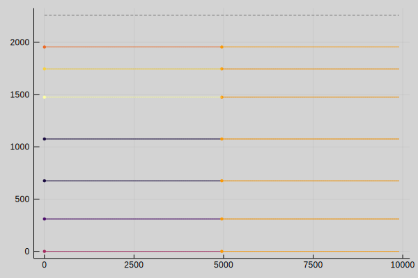
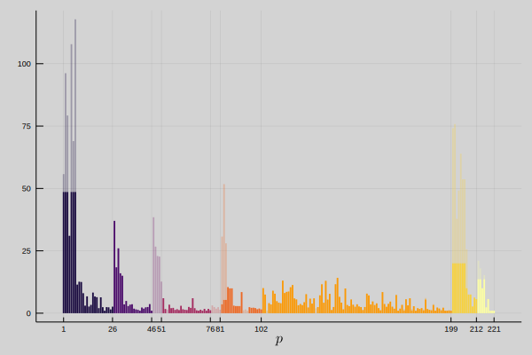
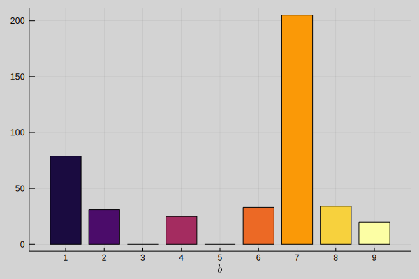
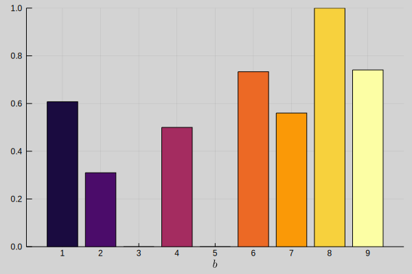

# Plotting
This section illustrates the results of the optimization model using visualizations implemented with `Plots.jl`.

## Planogram

Planogram visualizes the product placing on the shelves. Blocks are indicated by the different colors. A definition of planogram can be found at [^Rouse2010].

- [`plot_planogram`](@ref)
- [`plot_planograms`](@ref)
- [`plot_planogram_no_blocks`](@ref)
- [`plot_planograms_no_blocks`](@ref)

## Block Allocation

Block allocation visualizes the block starting location $x_{b,s}$ and block width $b_{b,s}$ for each block and for each shelf.

- [`plot_block_allocation`](@ref)
- [`plot_block_allocations`](@ref)

## Product Facings

Visualizes the number of product facings $∑_s n_{p,s}$ allocated per product. The opaque color indicates the maximum number of facings $N_p^{max}$ allowed per product.

[`plot_product_facings`](@ref)

## Demand and Sales

Visualizes the sales $s_p$ per product. The opaque color indicates the demand $D_p$ per product.

[`plot_demand_and_sales`](@ref)

## Allocation Amount

Allocation amount visualizes the total amount of products facings $∑_{p∈P_b,s∈S} n_{p,s}$ allocated to the shelves per block.

[`plot_allocation_amount`](@ref)

## Allocation Percentage

Allocation percentage visualizes the relative amount of product facings allocated to the shelves per block. Calculated by dividing the absolute amount of product facing allocated per block by the number of products that could be allocated to the shelves per block if there were no products from other blocks.

[`plot_allocation_percentage`](@ref)

## References
[^Rouse2010]: Rouse, M. (2010). What is planogram? Retrieved from [https://whatis.techtarget.com/definition/planogram](https://whatis.techtarget.com/definition/planogram)
